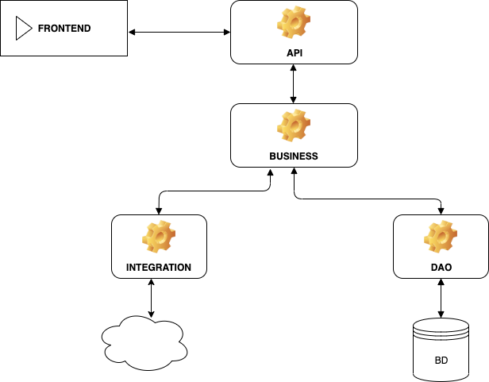

Patient Record (API)
============================================

We'll find resources to manager patients with histories.


Into the design, I provided 5 layers as known as tiers, with a specific accomplishment task:

* API 
* BUSINESS LOGIC 
* DAO 
* INTEGRATION   
* FRONTEND 


I use a multi-tier architectural model where the tiers order in the list, is strictly associated to the information flow.



## Files Structure
````bash
├── api
│   ├── pom.xml
│   └── src
│       ├── main
│       │   ├── java
│       │   │   └── org
│       │   │       └── encinas
│       │   │           └── api
│       │   │               ├── ApiApplication.java
│       │   │               ├── configuration
│       │   │               │   └── ApiConfiguration.java
│       │   │               └── web
│       │   │                   ├── HistoryController.java
│       │   │                   ├── PatientController.java
│       │   │                   └── error
│       │   │                       └── handler
│       │   │                           └── HandlerException.java
│       │   └── resources
│       │       └── application.yml
│       └── test
│           └── java
│               └── org
│                   └── encinas
│                       └── api
├── business
│   ├── pom.xml
│   └── src
│       ├── main
│       │   └── java
│       │       └── org
│       │           └── encinas
│       │               └── business
│       │                   ├── HistoryService.java
│       │                   ├── PatientService.java
│       │                   ├── configuration
│       │                   │   └── BusinessConfiguration.java
│       │                   ├── dtos
│       │                   │   ├── HistoryDto.java
│       │                   │   └── PatientDto.java
│       │                   ├── exceptions
│       │                   │   └── DuplicatedDniException.java
│       │                   ├── parsers
│       │                   │   ├── HistoryParser.java
│       │                   │   ├── Parser.java
│       │                   │   └── PatientParser.java
│       │                   └── responses
│       │                       └── Response.java
│       └── test
│           └── java
│               └── org
│                   └── encinas
│                       └── business
│                           ├── PatientServiceTest.java
│                           └── dtos
│                               └── PatientDtoTest.java
├── dao
│   ├── pom.xml
│   └── src
│       ├── main
│       │   └── java
│       │       └── org
│       │           └── encinas
│       │               └── dao
│       │                   ├── configuration
│       │                   │   └── DaoConfiguration.java
│       │                   ├── entity
│       │                   │   ├── History.java
│       │                   │   └── Patient.java
│       │                   └── repository
│       │                       ├── HistoryDao.java
│       │                       └── PatientDao.java
│       └── test
│           └── java
│               └── org
│                   └── encinas
│                       └── dao
├── pom.xml
````

### API 
In this tier falls the logic of presentation, it represents the entry point of our application, at least from the server point of view. It talks only with the BUSINESS LOGIC tier: a service will only call one or more services offered by the Business layer, it will never use the INTEGRATION or DAO tier directly, nor it will use objects defined within them, in order to avoid *tightly coupled* and *spaghetti code*.

### BUSINESS 
Each application has to deal with the logic of interaction between entities defined into the DAO tier. You have to combine user requirements with application logic, break them up and then expose to the upper tiers simple and readable signatures. So this tier lets developers to make some processing without entering into the details of how the database is structured or what integration is underneath.
The BUSINESS LOGIC communicates with the DAO tier and the INTEGRATION tier, creating a synergy and an interaction between them. Besides, it brings logic and data transformation into DTO, usable by other tiers.

### DAO 
Data Access Object. This tier performs the data, it describes the entities and the access logic. Simple data access logic of inserting, modifying, deleting and displaying data, without any binding to other tiers.

### INTEGRATION 
######(TODO)
We probably need to interoperate with other systems that don’t depend on our data.

### FRONTEND 
######(TODO)
It represents the Interface (UI), this type of application must be completely separated from the application and the usage of the Rest technology already guarantees this aspect

### TECHNOLOGIES USED
* Java 8
* Spring boot (2.1.8.RELEASE)
* Spring Data JPA
* JUnit 5
* Mockito
* PostgreSQL (42.2.5)
* Maven (3.6.2)
